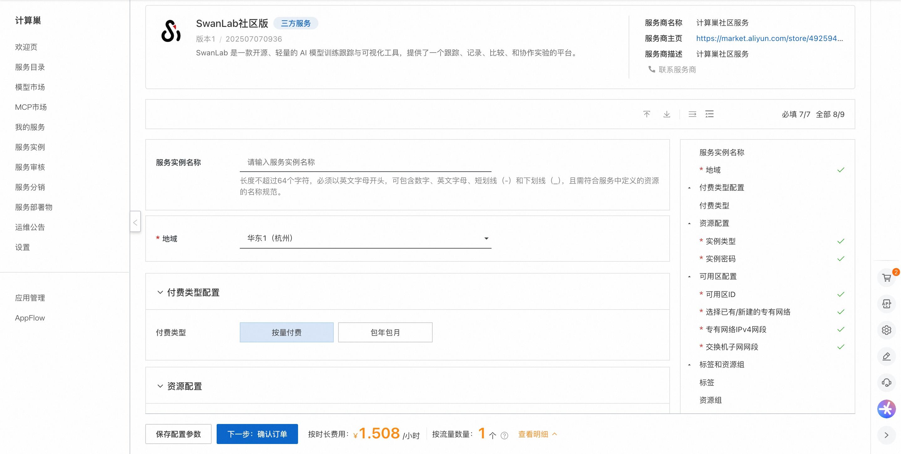
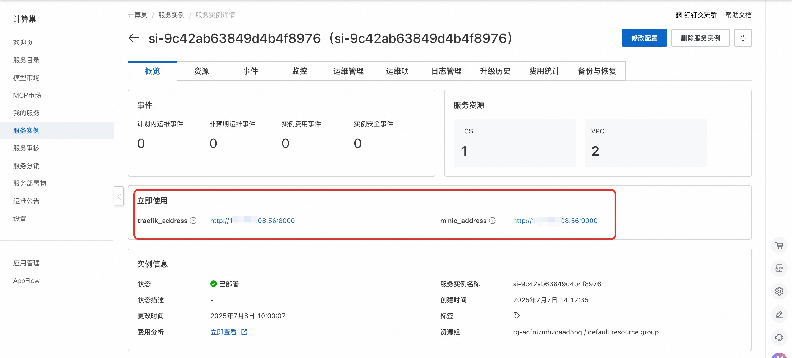
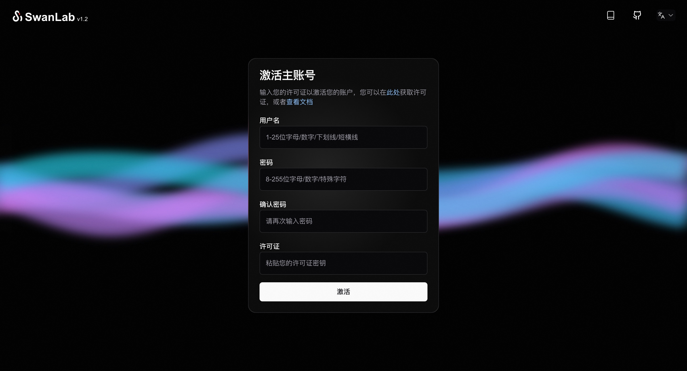

## 🌟 服务简介

SwanLab 是一款开源、轻量的 AI 模型训练跟踪与可视化工具，提供了一个跟踪、记录、比较、和协作实验的平台。

SwanLab 面向人工智能研究者，设计了友好的Python API
和漂亮的UI界面，并提供训练可视化、自动日志记录、超参数记录、实验对比、多人协同等功能。在SwanLab上，研究者能基于直观的可视化图表发现训练问题，对比多个实验找到研究灵感，并通过在线网页的分享与基于组织的多人协同训练，打破团队沟通的壁垒，提高组织训练效率。

## 💰 计费说明

SwanLab社区版在计算巢部署的费用主要涉及：

- 所选vCPU与内存规格
- 系统盘类型及容量
- 公网带宽

## 🚀 部署流程

1. 访问计算巢SwanLab社区版[部署链接](https://computenest.console.aliyun.com/service/instance/create/cn-hangzhou?type=user&ServiceId=service-cb2da57160444c3ebdbf)
，按提示填写部署参数：
   

2. 参数填写完成后可以看到对应询价明细，确认参数后点击**下一步：确认订单**。

3. 确认订单完成后同意服务协议并点击**立即创建**进入部署阶段。

4. 等待部署完成后就可以开始使用服务，进入服务实例详情点击服务地址。
   

5. 访问服务地址注册账号并使用SwanLab社区版。
   

# 📚 使用指南

更多用法请参考SwanLab[官网文档](https://docs.swanlab.cn/guide_cloud/general/what-is-swanlab.html)。